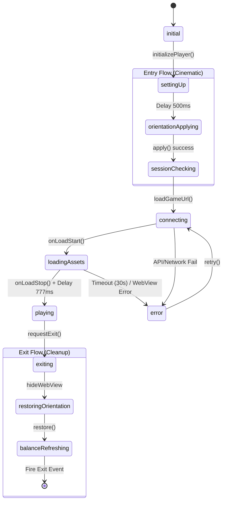

# Thiết kế Chi tiết Luồng GamePlayerNotifier

Tài liệu này mô tả kiến trúc State Machine và các luồng thực thi chính của `GamePlayerNotifier` để đảm bảo trải nghiệm người dùng (UX) mượt mà và code dễ bảo trì.

## 1. Sơ đồ Máy Trạng thái (State Machine Diagram)

---

## 2. Mô tả Chi tiết các Luồng (Detailed Flows)

### 🚀 A. Entry Flow (Luồng Vào Game)
Đây là giai đoạn quan trọng nhất để tránh tình trạng "giật lag" hệ thống.

1.  **Trạng thái `settingUp`**: Đánh dấu bắt đầu quá trình chuẩn bị.
2.  **Cinematic Delay (500ms)**: 
    - **Lý do**: Đợi animation chuyển trang (`PageRoute`) hoàn tất. 
    - **Tác dụng**: Tránh xung đột tài nguyên khi Flutter đang render animation và hệ thống gọi lệnh xoay màn hình vật lý.
3.  **Orientation Apply**: Gọi `orientationController.apply(gamePolicy)`. Sau khi xong, set `isOrientationReady = true`.
4.  **Session Guard**: Kiểm tra cooldown nếu game yêu cầu. Nếu còn thời gian chờ, notifier sẽ delay thêm đúng bằng thời gian đó trước khi gọi API lấy URL.

### 🌐 B. Loading Flow (Luồng Tải WebView)
Quản lý việc hiển thị nội dung game từ server.

1.  **Trạng thái `connecting`**: Gọi API `_repository.getGameUrl`.
2.  **Trạng thái `loadingAssets`**: Kích hoạt khi WebView bắt đầu load (sự kiện `onLoadStart`).
    - Bắt đầu chạy `_timeoutTimer` (30 giây). Nếu quá thời gian này mà game chưa load xong, hệ thống sẽ tự động chuyển sang trạng thái lỗi.
3.  **Trạng thái `playing`**: Kích hoạt sau khi WebView hoàn tất tải (`onLoadStop`).
    - **Finish Load Delay (777ms)**: Một khoảng chờ ngắn để đảm bảo engine của game đã render xong khung hình đầu tiên trước khi ẩn lớp Loading Overlay.

### 🚪 C. Exit Flow (Luồng Thoát Game)
Đảm bảo dọn dẹp sạch sẽ và đưa thiết bị về trạng thái ban đầu.

1.  **Trạng thái `exiting`**: 
    - Ngay lập tức set `showWebView = false` để ẩn game, tránh các lỗi hiển thị khi pop màn hình.
    - Chặn mọi tương tác từ người dùng.
2.  **Restore Orientation**: Xoay thiết bị về lại Portrait (hoặc policy trước đó).
3.  **Refresh Balance**: Gọi callback làm mới số dư tài khoản của người dùng.
4.  **Exit Event**: Sau 500ms (đợi xoay màn hình ổn định), bắn `GamePlayerExitEvent` để UI thực hiện lệnh `Navigator.pop()`.

### 🛠️ D. Error & Retry Flow (Luồng Xử lý Lỗi)
Đảm bảo ứng dụng không bị "chết" khi gặp sự cố mạng.

- **Phân loại lỗi**: Sử dụng `CaxiloFailure` để ánh xạ chính xác loại lỗi (Bảo trì, Mạng, Hết phiên, v.v.).
- **Cơ chế Retry**:
    - Tăng `retryCount`.
    - Nếu vượt quá `_maxRetryCount` (3 lần), hệ thống sẽ tự động chuyển sang màn hình bảo trì để bảo vệ tài nguyên server.

---

## 3. Các Nguyên tắc Thiết kế (Design Principles)

-   **Guard Clauses**: Mọi phương thức quan trọng đều có check `_isDisposed` và trạng thái hiện tại để tránh thực thi thừa.
-   **Unidirectional Data Flow**: UI chỉ đọc state và gửi sự kiện, Notifier toàn quyền quyết định logic chuyển trạng thái.
-   **Encapsulation**: Các Timer và biến trạng thái nội bộ được quản lý chặt chẽ, tự động dọn dẹp trong hàm `dispose()`.

---
*Tài liệu này được soạn thảo bởi Trippy - AI Coding Assistant.*
