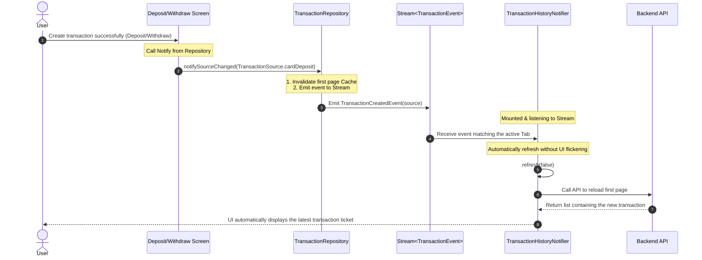

# Transaction History Automatic Synchronization Guide (Event-driven Sync Flow)

This document guides you on how to automatically synchronize data between the **Deposit / Withdraw** screens and the **Transaction History** screen in the `s88-flutter` project.

Thanks to the **Event-driven Sync** mechanism designed at the Repository level, the Transaction History screen automatically detects changes, invalidates the cache, and reloads the latest data as soon as the user successfully creates a transaction ticket anywhere in the application.

---

## 1. Architecture Flow

Below is the data and event propagation flow when a transaction is successfully created:



---

## 2. Implementation on the Deposit / Withdraw Screen (Sender Side)

When integrating a new transaction creation screen (e.g., Codepay bank deposit, mobile card scratch deposit, withdrawal gateway...), after receiving a successful response from the ticket creation API, developers **must perform the following 2 steps**:

### Step 2.1: Call Repository to notify source data changes
Through Riverpod, read `transactionRepositoryProvider` and call the `notifySourceChanged()` method with the correct matching `TransactionSource`:

```dart
// 1. If deposit via Codepay / Bank / Crypto is successful:
ref.read(transactionRepositoryProvider).notifySourceChanged(TransactionSource.paymentSlip);

// 2. If deposit via mobile scratch card is successful:
ref.read(transactionRepositoryProvider).notifySourceChanged(TransactionSource.cardDeposit);

// 3. If withdrawal to phone card is successful:
ref.read(transactionRepositoryProvider).notifySourceChanged(TransactionSource.cardWithdraw);
```

> [!NOTE]  
> **Underlying Mechanism**: The `notifySourceChanged` method automatically invalidates the 2-minute cache of the first page belonging to that transaction source, while broadcasting a `TransactionCreatedEvent` system-wide.

---

### Step 2.2: Redirect user to the Transaction History screen
To deliver the optimal user experience, after notifying the data source change, use the safe navigation method provided by the system via `profileNavigatorProvider` to close all dialogs, bottom sheets, or intermediate deposit screens, and redirect the user straight to the Transaction History screen:

```dart
// Safely navigate and clear the navigation stack down to the Root Profile screen
ref.read(profileNavigatorProvider).pushToTransactionHistoryAndRemoveUntil();
```

---

## 3. Example Implementation

Below is a complete implementation example inside a mobile scratch card deposit Bottom Sheet:

```dart
import 'package:flutter/material.dart';
import 'package:flutter_riverpod/flutter_riverpod.dart';
import 'package:sun_sports/core/services/repositories/transaction_repository/transaction_repository.dart';
import 'package:sun_sports/shared/profile_hub_system/profile_hub_system.dart';

class DepositCardBottomSheet extends ConsumerWidget {
  const DepositCardBottomSheet({super.key});

  @override
  Widget build(BuildContext context, WidgetRef ref) {
    return ElevatedButton(
      onPressed: () async {
        try {
          // 1. Call API to deposit scratch card
          await ref.read(depositServiceProvider).submitCard(
            serial: '10001234567',
            code: '918827364510',
            telco: 'viettel',
          );

          // 2. Notify Repository to synchronize Transaction History data
          ref.read(transactionRepositoryProvider).notifySourceChanged(
            TransactionSource.cardDeposit,
          );

          // 3. Show success Toast notification
          showToast('Scratch card deposit ticket created successfully!');

          // 4. Close bottom sheet and redirect user to Transaction History
          ref.read(profileNavigatorProvider).pushToTransactionHistoryAndRemoveUntil();

        } catch (error) {
          showErrorToast('Scratch card deposit failed: $error');
        }
      },
      child: const Text('Deposit Now'),
    );
  }
}
```

---

## 4. Automatic Refresh Mechanism on the Transaction History UI (Receiver Side)

The UI layer of the Transaction History screen uses the `TransactionHistoryNotifier` (which listens per filter tab through the Riverpod family `transactionHistoryProvider(filter)`).

Inside the Notifier, the automatic listening mechanism is set up as follows:

```dart
void _subscribeToEvents() {
  _eventSubscription = _repository.events.listen((event) {
    if (!mounted) return;

    bool shouldRefresh = false;

    if (event is TransactionCreatedEvent) {
      // Only automatically refresh if the deposit/withdraw event matches the source the filter tab cares about
      if (_filter.activeSources.contains(event.source)) {
        shouldRefresh = true;
      }
    } else if (event is TransactionMutatedEvent ||
        event is TransactionCacheInvalidatedEvent ||
        event is ComplainCreatedEvent) {
      // State change or history clearing events will refresh all tabs
      shouldRefresh = true;
    }

    if (shouldRefresh) {
      // Call refresh(false) to keep showing old data while loading the new page,
      // completely preventing UI flickering.
      refresh(false);
    }
  });
}
```

> [!IMPORTANT]  
> Thanks to Riverpod and the `autoDispose` mechanism, only the Notifiers of the tabs that are **actually displayed on screen (active/mounted)** listen and automatically call API data refresh. Hidden tabs will be refreshed lazily (lazy-loaded) when the user switches to that tab, which highly optimizes network bandwidth and application performance.
