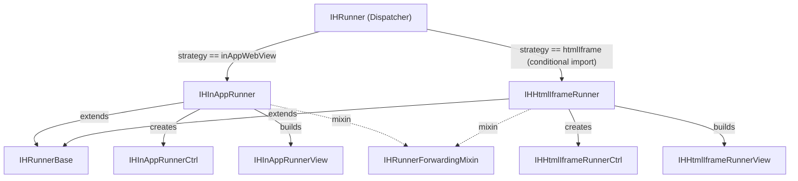

# Kế Hoạch Tái Cấu Trúc Điều Phối Hiển Thị IHRunner (v4)

Tài liệu mô tả kế hoạch tái cấu trúc cơ chế chọn chiến lược render (Rendering
Strategy Selection) của `IHRunner` trong package `game_engine`.

> **v4 (bản hiện tại):** Giữ nguyên thiết kế Pha 2 của v3 (Self-contained
> Runners + Dispatcher). Bổ sung: vá lỗ hổng cast runtime trong dispatcher,
> sửa lại **baseline test cho đúng thực tế repo**, và thêm mục **§7 Rủi Ro &
> Bug Tiềm Ẩn** liệt kê các điểm dễ vỡ kèm cách phòng.
>
> **Pha 1 đã verify trên code thật:** `build()` dùng `switch (_ctrl.strategy)`
> (`ih_runner.dart:182`), guard `is! IHInAppRunnerCtrl` đã được gỡ.

---

## 1. Bối Cảnh (Context)

`IHRunner` (In-House Game Runner) hỗ trợ hai chiến lược render trên Web:

1. **`InAppWebView` (mặc định):** render qua `flutter_inappwebview` — dùng cho cả
   Mobile (iOS/Android) lẫn Web. Controller: `IHInAppRunnerCtrl`, view:
   `IHInAppRunnerView`.
2. **`HtmlIframe` (phụ):** render trực tiếp thẻ `<iframe>` nguyên bản — dùng cho
   Firefox Web để bypass việc `flutter_inappwebview_web` không inject được JS vào
   cross-origin iframe (SOP). Controller: `IHHtmlIframeRunnerCtrl`, view:
   `IHHtmlIframeRunnerView` (web) + stub (mobile).

---

## 2. Các Vấn Đề Hiện Tại (Current Issues)

### Vấn đề 1 — `ih_runner.dart` là God Widget ✅ (đã giải quyết một phần ở Pha 1)
`build()` trước đây dùng `is` check, giờ đã chuyển sang `switch` trên `strategy`
enum. Tuy nhiên, file này vẫn **làm 3 việc cùng lúc**:

1. **Khởi tạo controller** (`_initController`) — biết về cả 2 loại controller cụ thể.
2. **Quản lý lifecycle & forwarding** (`_setupForwarding`, `dispose`) — logic dùng
   chung cho mọi strategy.
3. **Dispatch view** (`build`) — biết về cả 2 loại view cụ thể.

Khi thêm strategy thứ 3, phải sửa cả 3 vị trí trong cùng 1 file → vi phạm
Single Responsibility Principle (SRP).

### Vấn đề 2 — Thừa stub & conditional import dư thừa
- `ih_html_iframe_runner_view_stub.dart` tồn tại chỉ vì `ih_runner.dart` import
  trực tiếp view iframe.
- `ih_runner_stub.dart` có cả 2 nhánh (`dart.library.io` và `dart.library.js_interop`)
  đều trỏ về `inapp/inapp_runner_view.dart` → stub **không bao giờ được dùng**.

### Vấn đề 3 — Không cho phép external `IHHtmlIframeRunnerCtrl` ✅ (đã giải quyết ở Pha 1)

### Vấn đề 4 — Tài liệu lệch với code ✅ (đã giải quyết ở Pha 1)

---

## 3. Nguyên Tắc Thiết Kế (Design Principles)

1. **Nguồn chân lý của strategy là Controller.** Mỗi controller tự khai báo
   `IHRenderStrategy get strategy`.
2. **Thứ tự quyết định:**
   - Có `widget.controller` (external) → dùng **luôn** controller đó; strategy lấy
     từ `external.strategy`. **Không** browser-detect đè lên.
   - Không có external → browser-detect: Firefox → htmlIframe, còn lại → inAppWebView.
3. **Mỗi strategy là một widget tự đủ (self-contained).** Tự quản lý controller
   ownership, lifecycle, và build view. Dispatcher chỉ chọn widget nào để dựng.
4. **DRY qua mixin.** Logic forwarding events (`onStateChanged → onLoadStart/Stop/Error`)
   chung cho mọi strategy sẽ nằm trong một `mixin` dùng chung, không trùng lặp.

> Lưu ý: việc **cast** controller về kiểu cụ thể (ví dụ `as IHInAppRunnerCtrl`)
> vẫn tồn tại bên trong mỗi runner — đó là giới hạn cố hữu khi mỗi view yêu cầu
> kiểu controller riêng. Mục tiêu là "tách biệt trách nhiệm + dễ mở rộng".

---

## 4. Giải Pháp — Chia 2 Pha

### PHA 1 — Chuẩn hóa strategy bằng Enum ✅ HOÀN THÀNH

Đã triển khai trên branch `refactor/ih_runner_strategy`:
- Thêm `enum IHRenderStrategy` và `strategy` getter vào `IHRunnerCtrl`.
- Override `strategy` trong `IHInAppRunnerCtrl` và `IHHtmlIframeRunnerCtrl`.
- Chuyển `build()` từ `is` check sang `switch (_ctrl.strategy)`.
- Mở external controller cho mọi loại `IHRunnerCtrl` (bỏ chặn cứng `is! IHInAppRunnerCtrl`).
- Cập nhật docstring.
- `flutter analyze` + `flutter test` → pass 100%.

---

### PHA 2 — Tách IHRunner thành Self-contained Runners → Dispatcher

Mục tiêu: biến mỗi strategy thành một **widget độc lập có lifecycle riêng**, và
biến `IHRunner` thành một **thin dispatcher** chỉ chọn widget phù hợp.

#### 4.0. Lộ trình chia nhỏ (Incremental Sub-phases)

Pha 2 được chia thành **5 sub-phase**. Nguyên tắc: **mỗi sub-phase để lại
codebase biên dịch được + test xanh**, và verify độc lập trước khi sang bước kế.
Ba bước đầu (2A–2C) là **thuần additive — KHÔNG đổi hành vi runtime**; rủi ro dồn
vào đúng **một bước cutover (2D)**; 2E chỉ xóa file.

| Sub-phase | Nội dung | Đổi hành vi? | File chính | Verify |
|---|---|---|---|---|
| **2A** | Tạo `ih_runner_base.dart` (base widget + forwarding mixin) | ❌ Additive | `ih_runner_base.dart` [NEW] | analyze + test xanh |
| **2B** | Tạo `IHInAppRunner` self-contained (chưa nối dispatcher) | ❌ Additive | `inapp/inapp_runner.dart` [NEW] | + isolation test; app Chrome/mobile **không đổi** |
| **2C** | Tạo `IHHtmlIframeRunner` + stub (chưa nối dispatcher) | ❌ Additive | `html_iframe/ih_html_iframe_runner.dart` + `..._stub.dart` [NEW] | analyze mobile(stub)+web; app Firefox **không đổi** |
| **2D** | **Cutover**: `IHRunner` → thin `StatelessWidget` dispatcher, ủy quyền cả 2 nhánh | ✅ **CÓ** | `ih_runner.dart` [MODIFY] | dispatcher test + manual 5 nền tảng (xem dưới) |
| **2E** | Dọn file thừa (2 stub) + rename view | ❌ Additive | [DELETE]×2, [RENAME]×1 | analyze + test xanh; app **không đổi** |

> **Vì sao 2D không chia nhỏ hơn được:** `IHRunner` hiện sở hữu controller duy
> nhất qua `_initController`. Nếu chỉ chuyển *một* nhánh sang runner con (runner
> con tự tạo controller riêng) trong khi nhánh kia vẫn dùng controller của parent
> → tồn tại **2 controller cùng lúc / sở hữu mơ hồ**. Vì vậy việc bỏ quyền sở hữu
> controller ở parent và ủy quyền cả 2 nhánh phải diễn ra **nguyên tử** trong 2D.
> Bù lại, verify của 2D được chia theo từng nền tảng (Chrome → Firefox → mobile →
> đổi game → external).

---

##### Chi tiết verify từng sub-phase

**2A — Base + Mixin (additive)**
- *Tiêu chí:* `flutter analyze` sạch; toàn bộ 12 test cũ xanh. Chưa ai dùng base/mixin → 0 thay đổi hành vi.
- *Bạn test gì:* chỉ cần xác nhận build + test xanh. Đây là bước review thiết kế base/mixin trước khi runner phụ thuộc vào nó.
- *Rủi ro liên quan:* R8 (mẫu lifecycle của mixin) — chốt API mixin ở đây.

**2B — `IHInAppRunner` self-contained (additive, chưa wire)**
- *Tiêu chí:* thêm **isolation test** pump `IHInAppRunner` trực tiếp → render + forwarding chạy; test external `IHInAppRunnerCtrl` → không dispose external.
- *Bạn test gì:* chạy `flutter test` (test mới xanh) **và** chạy app trên **Chrome + mobile** → hành vi **y hệt trước** (vì `IHRunner` vẫn dùng path cũ, `IHInAppRunner` chưa được nối vào).
- *Rủi ro liên quan:* R6 (dispose external), R8.

**2C — `IHHtmlIframeRunner` + stub (additive, chưa wire)**
- *Tiêu chí:* `flutter analyze` **trên cả mobile (resolve stub) lẫn web (resolve real)** đều sạch; signature constructor web ≡ stub.
- *Bạn test gì:* chạy app trên **Firefox** → vẫn chạy bằng path cũ, hành vi **không đổi** (runner iframe mới chưa được nối). Xác nhận mobile vẫn build được.
- *Rủi ro liên quan:* **R5** (conditional import lệch signature) — verify kỹ ở đây.

**2D — Cutover dispatcher (ĐỔI HÀNH VI — bước rủi ro nhất)**
- *Tiêu chí auto:* thêm **dispatcher-mapping test** (§5.2); 12 test cũ + test 2B vẫn xanh.
- *Bạn test gì (theo thứ tự, dừng lại nếu fail):*
  1. **Chrome** → game in-house chạy bằng InAppWebView (nhánh default).
  2. **Firefox** → game in-house chạy bằng `<iframe>` (nhánh htmlIframe).
  3. **Mobile** → chạy InApp như cũ, stub iframe không bao giờ render.
  4. **Đổi game (webViewId đổi)** → WebView remount đúng, không đen màn / không leak (R4).
  5. **External controller** (nếu có luồng dùng) → không crash cast (R1), không dispose nhầm (R6).
- *Rủi ro liên quan:* **R1, R2, R4, R6** — tất cả hội tụ ở đây. Thêm `assert` cast-safety (§4.2.5) trong bước này.

**2E — Dọn dẹp (additive)**
- *Tiêu chí:* xóa `ih_runner_stub.dart` + `ih_html_iframe_runner_view_stub.dart`, rename `..._view_web.dart` → `..._view.dart`; `flutter analyze` + `flutter test` xanh; app không đổi.
- *Bạn test gì:* smoke test lại Chrome + Firefox + mobile để chắc rename/xóa không vỡ import.

---

#### 4.1. Kiến trúc tổng quan

```
ih_runner/
├── ih_runner.dart                        ← [MODIFY] Thin dispatcher (public API)
├── ih_runner_base.dart                   ← [NEW] Abstract base widget + forwarding mixin
├── ih_runner_ctrl.dart                   ← [GIỮ NGUYÊN] Base controller + enums
├── ih_runner_stub.dart                   ← [DELETE] Không còn cần
│
├── inapp/
│   ├── inapp_runner.dart                 ← [NEW] Self-contained InApp runner widget
│   ├── inapp_runner_ctrl.dart            ← [GIỮ NGUYÊN]
│   └── inapp_runner_view.dart            ← [GIỮ NGUYÊN]
│
├── html_iframe/
│   ├── ih_html_iframe_runner.dart        ← [NEW] Self-contained IFrame runner (web)
│   ├── ih_html_iframe_runner_stub.dart   ← [NEW] Stub runner (mobile) — thay thế view stub
│   ├── ih_html_iframe_runner_ctrl.dart   ← [GIỮ NGUYÊN]
│   ├── ih_html_iframe_runner_view_web.dart  ← [GIỮ NGUYÊN]
│   └── ih_html_iframe_runner_view_stub.dart ← [DELETE] Thay bằng runner-level stub
│
├── game_bridge_mixin.dart                ← [GIỮ NGUYÊN]
├── game_host_event.dart                  ← [GIỮ NGUYÊN]
├── game_media_control_mixin.dart         ← [GIỮ NGUYÊN]
└── scripts/                              ← [GIỮ NGUYÊN]
```

Sơ đồ luồng:



#### 4.2. Chi tiết từng file

---

##### 4.2.1. [NEW] `ih_runner_base.dart` — Interface & Forwarding Mixin

File này định nghĩa 2 thành phần:

**A. `IHRunnerBase` — Abstract base widget (Interface)**

Đây là "hợp đồng" (contract) mà mọi runner widget phải tuân thủ. Nó khai báo
tập tham số chung:

```dart
abstract class IHRunnerBase extends StatefulWidget {
  const IHRunnerBase({
    required this.gameUrl,
    this.logger = silentLogger,
    super.key,
    this.onLoadStart,
    this.onLoadStop,
    this.onError,
    this.onHostMessage,
    this.enableHostMessage = true,
  });

  final String gameUrl;
  final GameEngineLogger logger;
  final VoidCallback? onLoadStart;
  final VoidCallback? onLoadStop;
  final ValueChanged<String>? onError;
  final ValueChanged<GameHostEvent>? onHostMessage;
  final bool enableHostMessage;
}
```

> Lưu ý: `loadStopDebounce` KHÔNG nằm ở đây vì nó chỉ có ý nghĩa với InApp.
> `IHInAppRunner` sẽ khai báo thêm tham số này riêng.

> **Đừng oversell là "Interface":** không nơi nào giữ tham chiếu kiểu
> `IHRunnerBase` để gọi đa hình (dispatcher dựng thẳng kiểu cụ thể). Giá trị thật
> của base này là **(1) DRY cho field constructor** (qua `super.xxx`) và **(2)
> type-bound `<T extends IHRunnerBase>` cho mixin**. Nó là *shared-fields base
> class*, không phải contract đa hình — giữ vì 2 lý do trên là đủ.

**B. `IHRunnerForwardingMixin` — Shared lifecycle logic**

Mixin gom toàn bộ logic quản lý controller ownership và event forwarding.
Mọi self-contained runner chỉ cần `with` mixin này:

```dart
mixin IHRunnerForwardingMixin<T extends IHRunnerBase> on State<T> {
  // --- Controller Ownership ---
  IHRunnerCtrl? _ownedController;
  late final IHRunnerCtrl ctrl;

  /// Subclass gọi hàm này trong initState(), truyền external controller (nếu có)
  /// và hàm factory để tạo default controller.
  void initController({
    required IHRunnerCtrl? externalController,
    required IHRunnerCtrl Function() createDefault,
  }) {
    if (externalController != null) {
      ctrl = externalController;
    } else {
      _ownedController = createDefault();
      ctrl = _ownedController!;
    }
  }

  // --- Event Forwarding ---
  final List<StreamSubscription<dynamic>> _subs = [];

  void setupForwarding() {
    _subs.addAll([
      ctrl.onStateChanged.listen((state) {
        if (!mounted) return;
        switch (state) {
          case IHRunnerState.loading:
            widget.onLoadStart?.call();
          case IHRunnerState.loaded:
            widget.onLoadStop?.call();
          case IHRunnerState.error:
            widget.onError?.call(
              ctrl.lastErrorMessage ?? 'Failed to load game',
            );
          case IHRunnerState.idle:
            break;
        }
      }),
      ctrl.onHostMessage.listen((event) {
        if (!mounted) return;
        widget.onHostMessage?.call(event);
      }),
    ]);
  }

  void disposeForwarding() {
    for (final sub in _subs) {
      sub.cancel();
    }
    _ownedController?.dispose();
  }
}
```

Hiệu quả: Mọi runner đều **gọi 3 method** (`initController`, `setupForwarding`,
`disposeForwarding`) trong lifecycle của mình. Không trùng lặp code.

---

##### 4.2.2. [NEW] `inapp/inapp_runner.dart` — Self-contained InApp Runner

```dart
class IHInAppRunner extends IHRunnerBase {
  const IHInAppRunner({
    required super.gameUrl,
    this.controller,        // Kiểu cụ thể: IHInAppRunnerCtrl?
    super.logger,
    super.key,
    super.onLoadStart,
    super.onLoadStop,
    super.onError,
    super.onHostMessage,
    super.enableHostMessage,
    this.loadStopDebounce,  // Tham số riêng của InApp
  });

  final IHInAppRunnerCtrl? controller;
  final Duration? loadStopDebounce;

  @override
  State<IHInAppRunner> createState() => _IHInAppRunnerState();
}

class _IHInAppRunnerState extends State<IHInAppRunner>
    with IHRunnerForwardingMixin {
  @override
  void initState() {
    super.initState();
    initController(
      externalController: widget.controller,
      createDefault: () => IHInAppRunnerCtrl(
        logger: widget.logger,
        loadStopDebounce: widget.loadStopDebounce ?? Duration.zero,
        enableHostMessage: widget.enableHostMessage,
      ),
    );
    setupForwarding();
  }

  @override
  void dispose() {
    disposeForwarding();
    super.dispose();
  }

  @override
  Widget build(BuildContext context) {
    return IHInAppRunnerView(
      gameUrl: widget.gameUrl,
      controller: ctrl as IHInAppRunnerCtrl,
      logger: widget.logger,
      enableHostMessage: widget.enableHostMessage,
    );
  }
}
```

Đặc điểm:
- **Tự đủ**: tự tạo controller, tự quản lifecycle, tự build view.
- **Không import bất kỳ thứ gì thuộc html_iframe/**.
- **Testable**: có thể test riêng biệt mà không cần IHRunner dispatcher.
- Cast `ctrl as IHInAppRunnerCtrl` an toàn vì chính widget này tạo controller.

---

##### 4.2.3. [NEW] `html_iframe/ih_html_iframe_runner.dart` — Self-contained IFrame Runner (Web)

Tương tự InApp, nhưng dùng `IHHtmlIframeRunnerCtrl` + `IHHtmlIframeRunnerView`:

```dart
class IHHtmlIframeRunner extends IHRunnerBase {
  const IHHtmlIframeRunner({
    required super.gameUrl,
    this.controller,        // Kiểu cụ thể: IHHtmlIframeRunnerCtrl?
    super.logger,
    super.key,
    super.onLoadStart,
    super.onLoadStop,
    super.onError,
    super.onHostMessage,
    super.enableHostMessage,
  });

  final IHHtmlIframeRunnerCtrl? controller;

  @override
  State<IHHtmlIframeRunner> createState() => _IHHtmlIframeRunnerState();
}

class _IHHtmlIframeRunnerState extends State<IHHtmlIframeRunner>
    with IHRunnerForwardingMixin {
  @override
  void initState() {
    super.initState();
    initController(
      externalController: widget.controller,
      createDefault: () => IHHtmlIframeRunnerCtrl(logger: widget.logger),
    );
    setupForwarding();
  }

  @override
  void dispose() {
    disposeForwarding();
    super.dispose();
  }

  @override
  Widget build(BuildContext context) {
    return IHHtmlIframeRunnerView(
      gameUrl: widget.gameUrl,
      controller: ctrl as IHHtmlIframeRunnerCtrl,
      logger: widget.logger,
      enableHostMessage: widget.enableHostMessage,
    );
  }
}
```

File này import `package:web` gián tiếp qua view → chỉ compile trên web.

---

##### 4.2.4. [NEW] `html_iframe/ih_html_iframe_runner_stub.dart` — Stub (Mobile)

```dart
/// Stub — [IHHtmlIframeRunner] is only available on web.
class IHHtmlIframeRunner extends IHRunnerBase {
  const IHHtmlIframeRunner({
    required super.gameUrl,
    this.controller,
    super.logger,
    super.key,
    super.onLoadStart,
    super.onLoadStop,
    super.onError,
    super.onHostMessage,
    super.enableHostMessage,
  });

  final IHHtmlIframeRunnerCtrl? controller;

  @override
  State<IHHtmlIframeRunner> createState() => _StubState();
}

class _StubState extends State<IHHtmlIframeRunner> {
  @override
  Widget build(BuildContext context) => const SizedBox.shrink();
}
```

Stub này thay thế `ih_html_iframe_runner_view_stub.dart` cũ. Nó stub ở **tầng
runner** thay vì tầng view, nhất quán với kiến trúc mới.

---

##### 4.2.5. [MODIFY] `ih_runner.dart` — Thin Dispatcher

`IHRunner` chỉ còn 2 trách nhiệm:
1. Xác định strategy (từ external controller hoặc browser detection).
2. Dựng đúng runner widget.

```dart
import 'package:flutter/material.dart';

import '../logger.dart';
import '../plugins/plugins.dart';
import 'html_iframe/ih_html_iframe_runner_ctrl.dart';
// Conditional import: runner-level (thay vì view-level)
import 'html_iframe/ih_html_iframe_runner_stub.dart'
    if (dart.library.js_interop) 'html_iframe/ih_html_iframe_runner.dart';
import 'ih_runner_ctrl.dart';
import 'inapp/inapp_runner.dart';
import 'inapp/inapp_runner_ctrl.dart';

export 'game_bridge_mixin.dart';
export 'ih_runner_ctrl.dart';

class IHRunner extends StatelessWidget {            // ← Chuyển thành StatelessWidget
  const IHRunner({
    required this.gameUrl,
    this.controller,
    this.logger = silentLogger,
    super.key,
    this.onLoadStart,
    this.onLoadStop,
    this.onError,
    this.onHostMessage,
    this.enableHostMessage = true,
    this.loadStopDebounce,
  });

  final String gameUrl;
  final IHRunnerCtrl? controller;
  final GameEngineLogger logger;
  final VoidCallback? onLoadStart;
  final VoidCallback? onLoadStop;
  final ValueChanged<String>? onError;
  final ValueChanged<GameHostEvent>? onHostMessage;
  final bool enableHostMessage;
  final Duration? loadStopDebounce;

  /// Xác định strategy: external controller ưu tiên, sau đó browser-detect.
  IHRenderStrategy get _resolvedStrategy {
    if (controller != null) return controller!.strategy;
    if (isFirefoxBrowser) return IHRenderStrategy.htmlIframe;
    return IHRenderStrategy.inAppWebView;
  }

  @override
  Widget build(BuildContext context) {
    return switch (_resolvedStrategy) {
      IHRenderStrategy.inAppWebView => IHInAppRunner(
          gameUrl: gameUrl,
          // An toàn: strategy đến TỪ controller (xem §7 R1). Cast sai chỉ xảy ra
          // khi external controller báo strategy không khớp kiểu của nó.
          controller: controller as IHInAppRunnerCtrl?,
          logger: logger,
          onLoadStart: onLoadStart,
          onLoadStop: onLoadStop,
          onError: onError,
          onHostMessage: onHostMessage,
          enableHostMessage: enableHostMessage,
          loadStopDebounce: loadStopDebounce,
        ),
      // loadStopDebounce bị bỏ qua ở nhánh này là CHỦ ĐÍCH: chỉ InApp dùng nó.
      IHRenderStrategy.htmlIframe => IHHtmlIframeRunner(
          gameUrl: gameUrl,
          controller: controller as IHHtmlIframeRunnerCtrl?,
          logger: logger,
          onLoadStart: onLoadStart,
          onLoadStop: onLoadStop,
          onError: onError,
          onHostMessage: onHostMessage,
          enableHostMessage: enableHostMessage,
        ),
    };
  }
}
```

> **Vá lỗ hổng cast (§7 R1):** vì Pha 1 đã gỡ guard `is! IHInAppRunnerCtrl`, mọi
> `IHRunnerCtrl` đều truyền được vào. Cast `controller as IHInAppRunnerCtrl?` chỉ
> an toàn nếu **mọi controller báo `strategy == inAppWebView` đều thực sự là
> `IHInAppRunnerCtrl`**. Thêm `assert` đầu `_resolvedStrategy` (hoặc trong
> constructor) để fail-fast ở debug khi external controller báo strategy lệch kiểu:
> ```dart
> assert(
>   controller == null ||
>   (controller!.strategy == IHRenderStrategy.inAppWebView
>       ? controller is IHInAppRunnerCtrl
>       : controller is IHHtmlIframeRunnerCtrl),
>   'External controller có strategy ${controller?.strategy} nhưng không khớp '
>   'kiểu view tương ứng — sẽ gây TypeError lúc build.',
> );
> ```

**Thay đổi quan trọng:**
- `IHRunner` chuyển từ `StatefulWidget` → **`StatelessWidget`**. Toàn bộ state
  management chuyển xuống cho các runner con.
- Không còn `_initController`, `_setupForwarding`, `_ownedController`.
- Chỉ còn **1 conditional import** (runner iframe) thay vì 2 (view iframe + view inapp).
- **DRY miss đã biết:** `IHRunner` (Stateless) buộc phải khai báo lại 9 field
  giống `IHRunnerBase` (Stateful) vì không thể kế thừa — khác base class và khác
  kiểu controller (`IHRunnerCtrl?` vs kiểu cụ thể). Đây là trùng lặp không tránh
  được, chấp nhận.

---

##### 4.2.6. [DELETE] Các file thừa

| File | Lý do xóa |
|---|---|
| `ih_runner_stub.dart` | Cả 2 nhánh conditional đều trỏ cùng file; `IHInAppRunner` import trực tiếp |
| `html_iframe/ih_html_iframe_runner_view_stub.dart` | Thay bằng stub ở tầng runner (`ih_html_iframe_runner_stub.dart`) |

---

#### 4.3. So sánh Trước/Sau

| Tiêu chí | Trước (Pha 1) | Sau (Pha 2) |
|---|---|---|
| Số trách nhiệm của `ih_runner.dart` | 3 (init ctrl + forward + build) | 1 (dispatch) |
| Kiểu widget `IHRunner` | `StatefulWidget` | `StatelessWidget` |
| Thêm strategy thứ 3 | Sửa 3 chỗ trong `ih_runner.dart` | Tạo folder mới + 1 enum case |
| Số conditional import | 2 | 1 |
| Số file stub | 2 (`ih_runner_stub`, `view_stub`) | 1 (`runner_stub`) |
| Test isolation | Test qua `IHRunner` facade | Test từng runner độc lập |
| Logic forwarding | Viết 1 lần trong `_IHRunnerState` | Viết 1 lần trong mixin (DRY giữ nguyên) |

---

## 5. Kế Hoạch Kiểm Thử (Verification Plan)

### 5.1. Biên dịch tĩnh
- `flutter analyze` tại `packages/game_engine` — **không** lỗi trên cả mobile lẫn
  web. Đặc biệt kiểm tra conditional import resolve đúng `IHHtmlIframeRunner` (stub
  trên mobile, real trên web).

### 5.2. Test tự động — regression + hành vi MỚI

**Baseline THẬT (đã đếm lại trên repo — số liệu plan v3 sai):**

| File | Số test | Ghi chú |
|---|---|---|
| `test/game_engine_test.dart` | 1 | boilerplate |
| `test/logger_test.dart` | 1 | (v3 bỏ sót) |
| `test/cocos/cocos_web_view_test.dart` | **2** | chỉ `testWidgets`; v3 ghi nhầm "11" |
| `test/cocos/game_host_event_test.dart` | 8 | parsing host event |
| **Tổng** | **12** | con số 12 ở v3 đúng do trùng hợp, phân bổ sai |

> ⚠️ **Cảnh báo cảm-giác-an-toàn-giả:** 2 test trong `cocos_web_view_test.dart`
> hiện **chỉ assert `find.byType(IHRunner)`**, KHÔNG kiểm tra runner con nào được
> dựng. Do đó "12 test pass" **không** chứng minh dispatch chọn đúng strategy.
> Phải bổ sung test mapping bên dưới.

Test cần đảm bảo sau Pha 2:
- **Regression**: toàn bộ 12 test hiện có PHẢI pass nguyên vẹn.
- **Dispatcher mapping (MỚI)**: pump `IHRunner` (không controller, môi trường VM)
  → assert dựng `IHInAppRunner` (nhánh default trên VM). Đây là test khóa hành vi
  dispatch mà baseline cũ thiếu.
- **IHInAppRunner isolation (MỚI)**: pump `IHInAppRunner` trực tiếp → verify render
  + event forwarding (qua mixin) hoạt động.
- **External controller (MỚI)**: truyền external `IHInAppRunnerCtrl` → không tạo
  internal controller, **không** dispose external khi widget bị dispose.

> **Giới hạn không thể vượt — nhánh `htmlIframe` KHÔNG test được trên VM:**
> khi chạy `flutter test` (không có `dart.library.js_interop`),
> `IHHtmlIframeRunner` resolve sang **stub** (`SizedBox.shrink`). Vì vậy mapping
> *"strategy == htmlIframe → iframe runner thật"* **chỉ verify được qua manual
> test trên Firefox** (§5.3), không có cách nào trong unit test. Đừng tính nhánh
> này vào coverage tự động.

### 5.3. Manual test (BẮT BUỘC cho nhánh không test tự động được)
- **Firefox web**: chạy game in-house → phải dùng iframe strategy (xác nhận render
  bằng `<iframe>`, không phải InAppWebView).
- **Chrome web**: chạy game → phải dùng inAppWebView strategy.
- **Mobile**: xác nhận iframe runner stub không bao giờ render nội dung thật.
- **Remount khi đổi game (§7 R4)**: chuyển qua lại giữa 2 game có `webViewId` khác
  nhau → xác nhận WebView **dispose & tạo lại đúng** (do `ValueKey('ih-runner-...')`
  ở caller bọc trên `IHRunner`), không bị giữ lại WebView cũ / không leak controller.

---

## 6. Khuyến Nghị Triển Khai

1. **Pha 2 cần tách PR riêng** khỏi Pha 1 (đã commit trên `refactor/ih_runner_strategy`).
2. **Triển khai theo 5 sub-phase ở §4.0**, mỗi sub-phase **commit riêng** và chỉ
   sang bước kế sau khi bạn verify xong:

   | Sub-phase | Gate verify trước khi qua bước kế |
   |---|---|
   | 2A | analyze + 12 test cũ xanh |
   | 2B | isolation test xanh + app Chrome/mobile không đổi |
   | 2C | analyze mobile(stub)+web sạch + app Firefox không đổi |
   | 2D | dispatcher test xanh + manual 5 nền tảng (§4.0) pass |
   | 2E | analyze + test xanh + smoke test 3 nền tảng |

   → Nếu một sub-phase fail verify, chỉ cần revert đúng commit đó, không ảnh
   hưởng các bước trước.
3. **Thứ tự gợi ý mỗi sub-phase:** code → `flutter analyze` → `flutter test` →
   (nếu là 2B/2C/2D/2E) bạn chạy app verify thủ công → commit.
4. **Không trộn refactor kiến trúc vào branch fix_bug.**

---

## 7. Rủi Ro & Bug Tiềm Ẩn (Risks & Potential Bugs)

Bảng theo mức độ ưu tiên xử lý. Cột "Khi nào lộ" cho biết bug biểu hiện ở đâu.

| ID | Rủi ro | Khi nào lộ | Mức | Cách phòng |
|---|---|---|---|---|
| **R1** | **Cast crash từ external controller lệch strategy.** Pha 1 đã gỡ guard `is! IHInAppRunnerCtrl`, dispatcher lại cast `controller as IHInAppRunnerCtrl?`. Một `IHRunnerCtrl` tùy biến báo `strategy == inAppWebView` nhưng không kế thừa `IHInAppRunnerCtrl` → `TypeError`. | Runtime, khi có external controller "lạ" | **Cao** | `assert` cast-safety trong dispatcher (xem code §4.2.5) + ghi rõ contract: *strategy phải khớp kiểu view*. |
| **R2** | **False coverage.** 2 test cocos chỉ `find.byType(IHRunner)`, không assert runner con → đổi sai dispatch vẫn "pass". | CI báo xanh nhưng bug lọt | **Cao** | Thêm dispatcher-mapping test (§5.2). |
| **R3** | **Nhánh htmlIframe không có lưới an toàn tự động** (resolve sang stub trên VM). Hồi quy logic iframe chỉ phát hiện khi mở Firefox thủ công. | Runtime trên Firefox, sau khi merge | **Trung bình** | Manual test bắt buộc (§5.3); cân nhắc thêm 1 test web (`flutter test --platform chrome`) nếu CI hỗ trợ. |
| **R4** | **Sai vòng đời WebView khi đổi game.** Thêm 1 tầng widget (dispatcher → runner con) có thể đổi cách reconcile. Nếu key/identity không remount đúng khi `webViewId` đổi → WebView cũ bị giữ lại, hoặc controller không dispose (leak / màn hình đen). | Runtime, khi chuyển game | **Trung bình** | Verify thủ công remount (§5.3 R4); đảm bảo caller vẫn bọc `ValueKey` trên `IHRunner`. |
| **R5** | **Conditional import sai nhánh.** Nếu signature constructor của `IHHtmlIframeRunner` (web) và stub (mobile) **lệch nhau dù chỉ 1 param** → lỗi biên dịch khó hiểu trên đúng 1 nền tảng. | Compile-time, 1 nền tảng | **Trung bình** | Giữ 2 constructor **giống hệt** (copy-paste có chủ đích); chạy `flutter analyze` cho cả mobile lẫn web (Bước 6). |
| **R6** | **External controller bị dispose nhầm / không dispose.** Mixin chỉ dispose `_ownedController`; nếu logic `initController` sai nhánh → hoặc leak (owned không dispose) hoặc crash (dispose external mà chủ ngoài còn dùng). | Runtime, khi dùng external controller | **Trung bình** | Test "external không bị dispose" (§5.2); giữ đúng quy tắc: external → `_ownedController = null`. |
| **R7** | **`loadStopDebounce` rơi âm thầm ở nhánh htmlIframe.** Đúng chủ đích nhưng dễ bị hiểu nhầm là bug, hoặc tương lai cần debounce cho iframe mà quên. | Đọc code / mở rộng sau này | **Thấp** | Comment trong dispatcher (đã thêm §4.2.5). |
| **R8** | **`late final ctrl` chưa khởi tạo.** Nếu một runner con quên gọi `initController()` trong `initState` → `LateInitializationError` khi `build`/forwarding truy cập `ctrl`. | Runtime, khi thêm runner mới sai mẫu | **Thấp** | Mẫu cố định: `initState` luôn gọi `initController()` rồi `setupForwarding()`; document trong mixin. |
| **R9** | **Thiếu `enableHostMessage` xuống view.** Khi truyền external controller, `IHInAppRunnerCtrl` đã tạo từ trước với `enableHostMessage` riêng; runner lại truyền `widget.enableHostMessage` xuống view → có thể lệch giá trị giữa controller và view. | Runtime, edge case external + cờ lệch | **Thấp** | Làm rõ nguồn chân lý của `enableHostMessage` (controller hay widget); test nếu cần. |

### Nguyên tắc giảm rủi ro tổng thể
- **Fail-fast ở debug** (`assert`) cho mọi giả định cast/strategy — rẻ và chặn R1, R6.
- **Tách PR** Pha 2 riêng để dễ revert nếu R4 (vòng đời WebView) phát sinh trên thực địa.
- **Mỗi runner con copy đúng mẫu lifecycle** (initController → setupForwarding → dispose) — chặn R5, R8.
