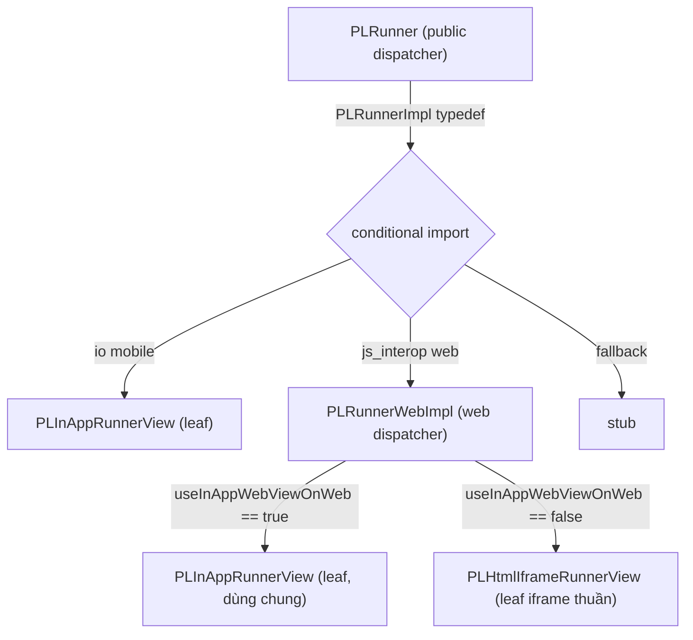

# Kế Hoạch Tái Cấu Trúc PLRunner (Provider-Live Runner) — v1

Tài liệu mô tả kế hoạch tái cấu trúc cơ chế điều phối hiển thị của `PLRunner`
trong package `game_engine`, áp dụng **cùng triết lý đã dùng cho IHRunner**
(self-contained leaf views + thin dispatcher), điều chỉnh cho đặc thù 2-trục
strategy của PL.

> **Bối cảnh liên quan:** xem `ih_runner_refactoring_plan.md`. PL runner **đã đi
> trước IH một bước** (đã có base widget + dispatcher + folder), nên trọng tâm ở
> đây KHÁC: không phải "tách dispatcher ra" mà là **gỡ logic dispatch đang bị
> chôn trong một View, dồn cờ về một chỗ, và sửa doc drift**.

---

## 1. Bối Cảnh (Context)

`PLRunner` (Provider-Live Runner) phục vụ game livestream / 3rd-party. Strategy
render có **2 trục**:

1. **Trục nền tảng (compile-time):** Mobile dùng `flutter_inappwebview`; Web có
   nhánh riêng. Chọn qua **conditional import** (`PLRunnerImpl` typedef).
2. **Trục web sub-strategy (runtime):** trên web, chọn giữa **InAppWebView** và
   **native `<iframe>`** qua cờ `useInAppWebViewOnWeb` (mặc định `true`).

### Cấu trúc hiện tại

```
PLRunner (StatelessWidget — public API, thin dispatcher)
  └─ PLRunnerImpl (typedef, resolve qua conditional import trong pl_runner.dart)
       ├─ io (mobile)      → inapp/inapp_runner_view.dart   → PLInAppRunnerView
       ├─ js_interop (web) → html_iframe/..._view.dart      → PLHtmlIframeRunnerView
       └─ fallback         → pl_runner_stub.dart            → PLInAppRunnerView (stub)
```

- Base: `PLRunnerPlatform` (abstract `StatefulWidget`, chứa toàn bộ param chung).
- Controller: `PLRunnerCtrl` (abstract) + `enum PLRunnerState`; 2 impl:
  `PLInAppRunnerCtrl`, `PLHtmlIframeRunnerCtrl`.
- `useInAppWebViewOnWeb` mặc định `true`. Caller production
  ([game_runner_view.dart:105](../../../../lib/features/game/runner/game_runner_view.dart#L105))
  **không set** cờ → luôn dùng default.

---

## 2. Các Vấn Đề Hiện Tại (Current Issues)

### Vấn đề P1 — Logic dispatch web bị CHÔN trong một "View" (smell chính)
`PLHtmlIframeRunnerView.build()`
([pl_html_iframe_runner_view.dart:126-128](../lib/src/provider_live_runner/html_iframe/pl_html_iframe_runner_view.dart#L126)):

```dart
Widget build(BuildContext context) {
  if (widget.useInAppWebViewOnWeb) {
    return PLInAppRunnerView( ... );   // ← View này thực ra là DISPATCHER
  }
  return HtmlElementView.fromTagName(tagName: 'iframe', ...);
}
```

Một class tên `...IframeRunnerView` lại **đẻ ra `PLInAppRunnerView`** — đặt sai
tên, trộn 2 trách nhiệm (dispatch + render iframe), vi phạm SRP. Đây đúng là
smell mà refactor IH đã loại bỏ.

### Vấn đề P2 — Doc drift nặng
`PLRunnerWebImpl` và `web/pl_runner_web.dart` được nhắc ở **≥5 chỗ**
([pl_runner.dart:19,125](../lib/src/provider_live_runner/pl_runner.dart#L19),
[pl_runner_platform_interface.dart:12](../lib/src/provider_live_runner/pl_runner_platform_interface.dart#L12),
inapp_runner_view.dart:41,196-197) nhưng **KHÔNG tồn tại**. Web impl thật là
`PLHtmlIframeRunnerView`. Tài liệu đang mô tả một thiết kế đã bị refactor bỏ —
chính là thiết kế mà plan này sẽ **khôi phục cho đúng**.

### Vấn đề P3 — `useInAppWebViewOnWeb` nhân bản 4 lần, không nằm ở base
Cờ này được khai báo riêng ở: `PLRunner`, `pl_runner_stub.dart`,
`PLInAppRunnerView`, `PLHtmlIframeRunnerView` — **không** có trong base
`PLRunnerPlatform`. Trong khi base ĐÃ chứa các param web-only khác (`viewId`,
`scaleContent`, `enableDimensionLock`) theo đúng mẫu "ignored on mobile". Việc cờ
này không ở base là một thiếu sót → 4 bản copy phải đồng bộ thủ công (bẫy
parity, xem RP4). Trên mobile (`PLInAppRunnerView`) cờ là **param chết**.

### Vấn đề P4 — Đường mặc định dư indirection
Production không set cờ → web default đi 2 hop:
`PLRunner → PLHtmlIframeRunnerView → PLInAppRunnerView` cho ca **phổ biến nhất**.

### Vấn đề P5 — Không có enum strategy thống nhất
PL chọn bằng (platform compile-time) × (bool runtime) — 2 cơ chế rời, không mô
hình hóa như `IHRenderStrategy`. (Mức ưu tiên thấp — xem Pha tùy chọn 3C.)

---

## 3. Nguyên Tắc Thiết Kế (Design Principles)

1. **Conditional-import target nào cũng phải có `typedef PLRunnerImpl`** với
   constructor **khớp y hệt** lời gọi trong `pl_runner.dart`. Đây là ràng buộc
   cứng của cơ chế (vi phạm = vỡ build đúng 1 nền tảng).
2. **View là leaf thuần.** `PLInAppRunnerView` chỉ render InAppWebView;
   `PLHtmlIframeRunnerView` chỉ render `<iframe>`. **Không** view nào được dispatch
   sang view khác.
3. **Web sub-strategy thuộc về một dispatcher web riêng** (`PLRunnerWebImpl` trong
   `web/pl_runner_web.dart`) — đúng cái mà doc đã hứa. Đây là nơi DUY NHẤT đọc
   `useInAppWebViewOnWeb`.
4. **Cờ web-only sống ở base.** Chuyển `useInAppWebViewOnWeb` vào
   `PLRunnerPlatform` (như `viewId`/`scaleContent`) → khai báo 1 lần, các subclass
   thừa kế qua `super`. Trên mobile cờ bị bỏ qua (chấp nhận, nhất quán hiện trạng).
5. **`PLInAppRunnerView` lưỡng dụng** (mobile + web khi flag=true) — refactor phải
   giữ nguyên tính chất này; không được biến nó thành web-only hay mobile-only.

> Lưu ý trung thực: giá trị refactor PL **nhỏ hơn IH** (PL đã có base+dispatcher).
> Lợi ích thật: gỡ smell P1, sửa doc P2, khử nhân bản P3. Đây là *cleanup chất
> lượng*, không phải thay đổi kiến trúc lớn.

---

## 4. Kiến Trúc Đích & Lộ Trình

### 4.1. Cấu trúc thư mục đích

```
provider_live_runner/
├── pl_runner.dart                       [MODIFY] conditional import → web/pl_runner_web.dart
├── pl_runner_platform_interface.dart    [MODIFY] thêm useInAppWebViewOnWeb vào base; sửa doc
├── pl_runner_ctrl.dart                  [GIỮ NGUYÊN]
├── pl_runner_stub.dart                  [MODIFY] bỏ field cờ trùng (thừa kế base); giữ typedef
│
├── inapp/
│   ├── inapp_runner_view.dart           [MODIFY] bỏ field cờ trùng; GIỮ typedef PLRunnerImpl (mobile target)
│   └── inapp_runner_ctrl.dart           [GIỮ NGUYÊN]
│
├── html_iframe/
│   ├── pl_html_iframe_runner_view.dart  [MODIFY] iframe THUẦN: bỏ switch + field cờ + XÓA typedef
│   └── pl_html_iframe_runner_ctrl.dart  [GIỮ NGUYÊN]
│
├── web/                                 [NEW folder]
│   └── pl_runner_web.dart               [NEW] PLRunnerWebImpl (web dispatcher) + typedef PLRunnerImpl
│
└── scripts/                             [GIỮ NGUYÊN]
```

Sơ đồ luồng đích:



### 4.2. Lộ trình chia nhỏ (Incremental Sub-phases)

Cùng triết lý IH: **mỗi sub-phase để codebase build được**; additive trước,
cutover gói gọn một bước, cleanup cuối. Nhưng PL **không có test net** (RP1) nên
thêm **Pha 0 bắt buộc: viết characterization test trước**.

| Sub-phase | Nội dung | Đổi hành vi? | Verify |
|---|---|---|---|
| **3·0** | **Characterization test** (chốt hành vi hiện tại làm lưới an toàn) | ❌ | test mới xanh trên hành vi HIỆN TẠI |
| **3A** | Thêm `useInAppWebViewOnWeb` vào base + khử field trùng ở các subclass | ❌ Additive/refactor nội bộ | analyze + test xanh; app không đổi |
| **3B** | Tạo `web/pl_runner_web.dart` (`PLRunnerWebImpl`) — chưa nối vào `pl_runner.dart` | ❌ Additive | analyze web sạch; app không đổi (vẫn path cũ) |
| **3C** | Biến `PLHtmlIframeRunnerView` thành iframe THUẦN (bỏ switch) | ⚠️ chỉ ảnh hưởng khi `flag=false` | analyze; test iframe-only nếu có |
| **3D** | **Cutover**: đổi conditional import web → `web/pl_runner_web.dart`; xóa typedef cũ ở iframe view | ✅ **CÓ** (hot path web) | dispatcher test + manual 4 nền tảng |
| **3E** | Dọn doc drift (P2) + (tùy chọn) enum `PLRenderStrategy` (P5) | ❌ | analyze + test; review doc |

> **Thứ tự 3C trước 3D có chủ đích:** biến iframe view thành thuần TRƯỚC, rồi mới
> trỏ web dispatcher vào nó. Nếu làm ngược, có lúc dispatcher gọi iframe view mà
> view đó vẫn còn switch nội bộ → đệ quy/nhập nhằng.

---

### 4.3. Chi tiết các file MỚI / SỬA quan trọng

#### 4.3.1. [MODIFY] `pl_runner_platform_interface.dart` — đưa cờ vào base (Pha 3A)

Thêm vào `PLRunnerPlatform` (khu vực "Web-only configuration"):

```dart
/// Whether to use `flutter_inappwebview` instead of a native `<iframe>` on Web.
///
/// **Web only.** Đọc bởi [PLRunnerWebImpl] để chọn nhánh render. Ignored on mobile.
/// Defaults to `true`.
final bool useInAppWebViewOnWeb;
```
…và thêm `this.useInAppWebViewOnWeb = true,` vào constructor base. Đồng thời
**sửa docstring** bỏ tham chiếu sai và mô tả đúng `PLRunnerWebImpl`.

Sau đó **bỏ** khai báo `final bool useInAppWebViewOnWeb;` + tham số constructor
khỏi: `pl_runner_stub.dart`, `inapp/inapp_runner_view.dart`,
`html_iframe/pl_html_iframe_runner_view.dart` → thay bằng `super.useInAppWebViewOnWeb`.

#### 4.3.2. [NEW] `web/pl_runner_web.dart` — Web dispatcher (Pha 3B)

```dart
import 'package:flutter/widgets.dart';

import '../pl_runner_platform_interface.dart';
// QUAN TRỌNG: import `show` để KHÔNG kéo theo `typedef PLRunnerImpl` của file leaf
// (sẽ xung đột với typedef PLRunnerImpl khai báo bên dưới). Xem RP4/RP8.
import '../inapp/inapp_runner_view.dart' show PLInAppRunnerView;
import 'pl_html_iframe_runner_view.dart' show PLHtmlIframeRunnerView;

/// {@template pl_runner_web_impl}
/// Web-only dispatcher: chọn giữa InAppWebView và native `<iframe>` dựa trên
/// [useInAppWebViewOnWeb]. Đây là nơi DUY NHẤT đọc cờ này trên web.
/// {@endtemplate}
class PLRunnerWebImpl extends PLRunnerPlatform {
  const PLRunnerWebImpl({
    required super.gameUrl,
    super.logger,
    super.controller,
    super.key,
    super.onLoadStart,
    super.onLoadStop,
    super.onError,
    super.viewId,
    super.forceLandscapeViewport,
    super.scaleContent,
    super.enableDimensionLock,
    super.blockFullscreen,
    super.useInAppWebViewOnWeb,
    super.loadStopDebounce,
  });

  @override
  State<PLRunnerWebImpl> createState() => _PLRunnerWebImplState();
}

class _PLRunnerWebImplState extends State<PLRunnerWebImpl> {
  @override
  Widget build(BuildContext context) {
    if (widget.useInAppWebViewOnWeb) {
      return PLInAppRunnerView(
        gameUrl: widget.gameUrl,
        logger: widget.logger,
        controller: widget.controller,
        onLoadStart: widget.onLoadStart,
        onLoadStop: widget.onLoadStop,
        onError: widget.onError,
        viewId: widget.viewId,
        forceLandscapeViewport: widget.forceLandscapeViewport,
        scaleContent: widget.scaleContent,
        enableDimensionLock: widget.enableDimensionLock,
        blockFullscreen: widget.blockFullscreen,
        loadStopDebounce: widget.loadStopDebounce,
      );
    }
    return PLHtmlIframeRunnerView(
      gameUrl: widget.gameUrl,
      logger: widget.logger,
      controller: widget.controller,
      onLoadStart: widget.onLoadStart,
      onLoadStop: widget.onLoadStop,
      onError: widget.onError,
      viewId: widget.viewId,
      forceLandscapeViewport: widget.forceLandscapeViewport,
      scaleContent: widget.scaleContent,
      enableDimensionLock: widget.enableDimensionLock,
      blockFullscreen: widget.blockFullscreen,
      loadStopDebounce: widget.loadStopDebounce,
    );
  }
}

/// Web target cho conditional import trong [PLRunner].
typedef PLRunnerImpl = PLRunnerWebImpl;
```

> Nội dung `build()` này **chuyển nguyên xi** từ `PLHtmlIframeRunnerView.build()`
> hiện tại — đây là phép *move*, không phải viết logic mới. Giảm rủi ro.

#### 4.3.3. [MODIFY] `html_iframe/pl_html_iframe_runner_view.dart` — iframe THUẦN (Pha 3C)

- **Xóa** nhánh `if (widget.useInAppWebViewOnWeb) return PLInAppRunnerView(...)` —
  `build()` chỉ còn phần `HtmlElementView.fromTagName('iframe', ...)`.
- **Xóa** `import '../inapp/inapp_runner_view.dart';` (không còn delegate).
- **Xóa** `typedef PLRunnerImpl = PLHtmlIframeRunnerView;` (web target giờ là
  `PLRunnerWebImpl`).
- Field cờ đã bỏ ở 3A (thừa kế base, nhưng view này không đọc nó nữa).

#### 4.3.4. [MODIFY] `pl_runner.dart` — đổi conditional import (Pha 3D, CUTOVER)

```dart
import 'pl_runner_stub.dart'
    if (dart.library.io) 'inapp/inapp_runner_view.dart'
    if (dart.library.js_interop) 'web/pl_runner_web.dart';   // ← đổi từ html_iframe/...
```

Phần `build()` của `PLRunner` **giữ nguyên** (vẫn gọi `PLRunnerImpl(...)`). Sửa
luôn docstring lớp `PLRunner` cho khớp `PLRunnerWebImpl`.

---

## 5. Kế Hoạch Kiểm Thử (Verification Plan)

### 5.1. Baseline test — **HIỆN TẠI = 0** ⚠️
PL runner **không có test nào** (chỉ IH/cocos có). Đây là rủi ro lớn nhất (RP1)
→ **Pha 3·0 bắt buộc viết characterization test trước khi đụng code production.**

### 5.2. Giới hạn môi trường VM (giống IH)
`flutter test` chạy trên Dart VM → `dart.library.io == true` → conditional import
resolve sang **mobile branch** (`inapp/inapp_runner_view.dart`). Nghĩa là:
- ✅ Test được trên VM: `PLRunner` → `PLInAppRunnerView`; ownership controller;
  event forwarding của InApp view.
- ❌ **KHÔNG** test được trên VM: `PLRunnerWebImpl` và nhánh `<iframe>` (web-only,
  cần `js_interop`). → **chỉ manual test trên trình duyệt** (giống IH R3).

### 5.3. Test tự động cần có
- **3·0 (characterization, trước refactor):**
  - pump `PLRunner` (VM) → `find.byType(PLInAppRunnerView)` (cần mock
    `InAppWebViewPlatform` như `cocos_web_view_test.dart`).
  - ownership: external `PLInAppRunnerCtrl` → KHÔNG bị dispose; internal → bị dispose.
- **Sau 3D:**
  - lặp lại các test trên → vẫn xanh (chứng minh hành vi mobile không đổi).
  - **Không** thêm được test VM cho nhánh web → đánh dấu rõ là manual-only.

### 5.4. Manual test (gate DUY NHẤT cho nhánh web)
1. **Chrome, default (`useInAppWebViewOnWeb=true`)** → game livestream chạy bằng
   InAppWebView. **Hot path — verify đầu tiên** (RP5).
2. **Chrome, `useInAppWebViewOnWeb=false`** → render `<iframe>` thật; dimension
   lock + crash detection mixin vẫn hoạt động (RP6).
3. **Mobile (iOS/Android)** → InAppWebView như cũ; cờ web bị bỏ qua.
4. **Đổi game (`viewId/webViewId` đổi)** → WebView remount đúng,
   `forceLandscapeViewport` (landscape iPad) vẫn áp đúng, không leak (RP5).

---

## 6. Khuyến Nghị Triển Khai

1. **Cân nhắc ưu tiên:** giá trị PL < IH. Nếu nguồn lực hạn chế, có thể **chỉ làm
   Pha 3E (sửa doc drift)** trước như quick-win, hoãn phần cutover.
2. **Nếu làm full:** theo thứ tự **3·0 → 3A → 3B → 3C → 3D → 3E**, mỗi sub-phase
   **commit riêng**:

   | Sub-phase | Gate trước khi qua bước kế |
   |---|---|
   | 3·0 | characterization test xanh trên hành vi hiện tại |
   | 3A | analyze + test xanh; app 3 nền tảng không đổi |
   | 3B | analyze web sạch (file mới chưa wire) |
   | 3C | analyze; app default không đổi (iframe view chưa là entry) |
   | 3D | dispatcher test + manual Chrome(true)→Chrome(false)→mobile→đổi game |
   | 3E | review doc; analyze + test xanh |

3. **Tách PR riêng**, KHÔNG trộn vào branch fix_bug.
4. **Verify hot path (Chrome default) NGAY ở đầu 3D** — nếu vỡ thì revert đúng
   commit cutover, các pha additive trước vẫn an toàn.

---

## 7. Rủi Ro & Bug Tiềm Ẩn (Risks & Potential Bugs)

| ID | Rủi ro | Khi nào lộ | Mức | Cách phòng |
|---|---|---|---|---|
| **RP1** | **Zero test net.** PL không có test nào → refactor rơi tự do. | Bất cứ regression nào lọt CI | **Cao** | Pha 3·0 viết characterization test TRƯỚC; manual test bắt buộc (§5.4). |
| **RP2** | **Blast radius lớn** — PL = livestream/3rd-party, dùng nhiều. | Production, dễ thấy | **Cao** | Cutover gói 1 commit, verify hot path đầu tiên, sẵn sàng revert. |
| **RP3** | **Phá tính lưỡng dụng của `PLInAppRunnerView`** (mobile + web khi flag=true). Nếu lỡ biến nó web-only/mobile-only → vỡ 1 nền tảng. | Compile hoặc runtime, 1 nền tảng | **Cao** | Giữ `PLInAppRunnerView` là leaf cross-platform; web dispatcher import nó qua `show`. |
| **RP4** | **Bẫy constructor-parity.** Mọi target `PLRunnerImpl` (stub, inapp mobile, web) phải có constructor khớp lời gọi `pl_runner.dart`. ~12 param → dễ lệch. | Compile-time, đúng 1 nền tảng | **Cao** | Đưa cờ về base (3A) giảm bản copy; chạy `analyze` cho cả io lẫn js_interop. |
| **RP5** | **Đổi hành vi HOT PATH.** Web default đổi cây widget (bỏ hop `IframeView`) → rủi ro remount/orientation polyfill (`forceLandscapeViewport` cho iPad). | Runtime web, ca phổ biến nhất | **Cao** | Verify Chrome-default đầu tiên (§5.4·1); kiểm tra landscape iPad + remount khi đổi game. |
| **RP6** | **package:web + mixin web-only** (`IFrameDimensionLockMixin`, `IFrameCrashDetectionMixin`) phải tuyệt đối sau `js_interop`. | Compile mobile nếu rò rỉ | **Trung bình** | iframe view chỉ được import bởi `web/pl_runner_web.dart` (js_interop); mobile không bao giờ chạm. |
| **RP7** | **External controller lệch kiểu** (`PLInAppRunnerCtrl` vs `PLHtmlIframeRunnerCtrl`) khi dispatcher chọn view theo cờ. | Runtime, khi truyền external ctrl + cờ lệch | **Trung bình** | Hiện caller không truyền external ctrl; nếu mở thì document contract: cờ phải khớp kiểu ctrl. |
| **RP8** | **Xung đột `typedef PLRunnerImpl`** trong `web/pl_runner_web.dart` (vừa import leaf định nghĩa typedef, vừa khai báo typedef của mình). | Compile-time web | **Trung bình** | Import leaf bằng `show <ClassName>` (đã ghi ở 4.3.2); xóa typedef cũ ở iframe view (3C). |
| **RP9** | **Doc tiếp tục drift** sau refactor nếu quên cập nhật. | Đọc code sau này | **Thấp** | Pha 3E rà soát toàn bộ tham chiếu `PLRunnerWebImpl`/`web/pl_runner_web.dart`. |

### Nguyên tắc giảm rủi ro tổng thể
- **Test trước, refactor sau** (3·0) — vì RP1 là rủi ro nền tảng.
- **Move, đừng rewrite**: logic switch web là copy nguyên từ chỗ cũ sang dispatcher.
- **Verify hot path (Chrome default) ngay đầu cutover** — chặn RP2/RP5 sớm.
- **`analyze` cả 2 nền tảng mỗi sub-phase** — chặn RP4/RP6/RP8.
